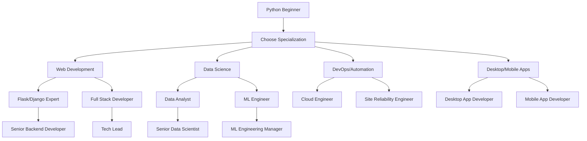

<div align="center">

# 🐍 Python Developer Roadmap — 2025 Edition
### *Complete Learning Path from Beginner to Expert*


<p align="center">
  
  
  
  
</p>

<p align="center">
  
</p>

---

<table>
<tr>
<td align="center" width="25%">

<br><strong>Portfolio Ready</strong>
</td>
<td align="center" width="25%">

<br><strong>Zero Cost</strong>
</td>
<td align="center" width="25%">

<br><strong>Industry Skills</strong>
</td>
<td align="center" width="25%">

<br><strong>Career Launch</strong>
</td>
</tr>
</table>

<p align="center">
  <a href="#-getting-started">
    
  </a>
  <a href="#-roadmap-overview">
    
  </a>
  <a href="#-project-portfolio">
    
  </a>
  <a href="#-resources">
    
  </a>
</p>

</div>

---

## 🎯 **Overview**

<div align="center">

**Transform from Beginner to Python Expert** 🚀

*Complete roadmap with Python fundamentals, web development, API creation, desktop apps, and production deployment skills*

</div>

<table>
<tr>
<td width="50%">

### 🎓 **What You'll Master**
- 🐍 **Python Fundamentals** - Syntax, OOP, data structures
- 🌐 **Web Development** - Django, Flask, FastAPI
- 📡 **API Development** - REST, GraphQL, microservices
- 🗄️ **Database Management** - SQL, NoSQL, ORMs
- 🖥️ **Desktop Applications** - Tkinter, PyQt, Kivy
- ☁️ **Cloud & DevOps** - AWS, Docker, CI/CD
- 📊 **Data Science** - NumPy, Pandas, visualization
- 🧪 **Testing & Quality** - Unit tests, TDD, code quality

</td>
<td width="50%">

### 📈 **Learning Approach**
- 📖 **Theory + Practice** - Concepts with hands-on coding
- 🛠️ **Project-Driven** - Build real applications
- 🆓 **100% Free Resources** - No paid courses required
- 🌐 **Community Support** - Join global Python community
- 📊 **Progressive Path** - Clear milestones & structured learning
- 🏆 **Career Focus** - Job-ready skills and portfolio

</td>
</tr>
</table>

---

## 🛠️ **Prerequisites & Setup**

<details>
<summary><b>📋 Required Background (Click to expand)</b></summary>

### ✅ **Must Have:**
- [ ] **Basic Computer Skills** - File management, software installation
- [ ] **Logical Thinking** - Problem-solving mindset
- [ ] **Basic Math** - Arithmetic, basic algebra
- [ ] **English Proficiency** - Reading documentation

### 🔧 **Development Environment:**

```bash
# 🐍 Python Installation (Choose one)
# Option 1: Python.org
# Download from https://python.org/downloads/

# Option 2: Anaconda (Recommended for beginners)
# Download from https://anaconda.com/products/distribution

# 📦 Essential Packages
pip install --upgrade pip
pip install virtualenv
pip install pipenv
pip install poetry

# 💻 Code Editor (Choose one)
# - VS Code (Recommended)
# - PyCharm Community
# - Sublime Text
# - Vim/Neovim

# 🔗 Version Control
# Install Git from https://git-scm.com/
git config --global user.name "Your Name"
git config --global user.email "your.email@example.com"
```

### 🗂️ **Project Structure:**
```
python-learning-journey/
├── 01-fundamentals/
├── 02-intermediate/
├── 03-web-development/
├── 04-apis-databases/
├── 05-desktop-apps/
├── 06-data-science/
├── 07-testing-deployment/
└── portfolio/
```

</details>

---

## 📍 **Roadmap Overview**

<div align="center">

</div>

<table>
<tr>
<th width="15%">📅 Phase</th>
<th width="40%">🎯 Focus Area</th>
<th width="30%">🛠️ Technologies</th>
<th width="15%">📊 Level</th>
</tr>

<tr>
<td align="center">

</td>
<td>
<b>Python Basics & Programming Fundamentals</b><br>
<small>Syntax, data types, control flow, functions, OOP</small>
</td>
<td>
<code>Python</code> <code>IDE</code> <code>Git</code> <code>PEP8</code>
</td>
<td align="center">
🌱<br><small>Beginner</small>
</td>
</tr>

<tr>
<td align="center">

</td>
<td>
<b>Advanced Python & Data Handling</b><br>
<small>Modules, packages, file I/O, error handling, libraries</small>
</td>
<td>
<code>Modules</code> <code>Packages</code> <code>JSON</code> <code>CSV</code>
</td>
<td align="center">
🚀<br><small>Intermediate</small>
</td>
</tr>

<tr>
<td align="center">

</td>
<td>
<b>Web Development & Frameworks</b><br>
<small>Django, Flask, FastAPI, templates, forms</small>
</td>
<td>
<code>Django</code> <code>Flask</code> <code>FastAPI</code> <code>HTML/CSS</code>
</td>
<td align="center">
⚡<br><small>Advanced</small>
</td>
</tr>

<tr>
<td align="center">

</td>
<td>
<b>APIs & Database Management</b><br>
<small>REST APIs, GraphQL, SQL, NoSQL, ORMs</small>
</td>
<td>
<code>REST</code> <code>GraphQL</code> <code>SQLAlchemy</code> <code>MongoDB</code>
</td>
<td align="center">
🔥<br><small>Expert</small>
</td>
</tr>

<tr>
<td align="center">

</td>
<td>
<b>Desktop & Mobile Applications</b><br>
<small>GUI development, cross-platform apps</small>
</td>
<td>
<code>Tkinter</code> <code>PyQt</code> <code>Kivy</code> <code>Flet</code>
</td>
<td align="center">
🔥<br><small>Expert</small>
</td>
</tr>

<tr>
<td align="center">

</td>
<td>
<b>Testing, Deployment & Career</b><br>
<small>Unit testing, CI/CD, Docker, cloud deployment</small>
</td>
<td>
<code>pytest</code> <code>Docker</code> <code>AWS</code> <code>GitHub Actions</code>
</td>
<td align="center">
🏆<br><small>Master</small>
</td>
</tr>

</table>

---

## 📚 **Detailed Learning Path**

### 🐍 **Phase 1-4: Python Fundamentals (Weeks 1-8)**

<details>
<summary><b>🎯 Week 1-2: Python Basics</b></summary>

<br>

<div align="center">

</div>

#### **🚀 Getting Started (Week 1)**

<table>
<tr>
<td width="70%">

**📚 Free Resources:**
- [Python.org Tutorial](https://docs.python.org/3/tutorial/) - Official Python tutorial
- [Automate the Boring Stuff](https://automatetheboringstuff.com/) - Practical Python for beginners
- [Python for Everybody](https://www.py4e.com/) - University of Michigan course

**🎯 Mini-Project:** **Personal Calculator** - Build a command-line calculator

</td>
<td width="30%">

**🔧 Daily Focus:**
- **Day 1-2:** Installation & setup
- **Day 3-4:** Variables & data types
- **Day 5-6:** Basic operations
- **Day 7:** Simple programs

</td>
</tr>
</table>

#### **🔀 Control Flow & Functions (Week 2)**

<table>
<tr>
<td width="70%">

**📚 Free Resources:**
- [Real Python Conditionals](https://realpython.com/python-conditional-statements/) - If, elif, else
- [Python Loops Tutorial](https://realpython.com/python-for-loop/) - For and while loops
- [Functions in Python](https://realpython.com/defining-your-own-python-function/) - Function basics

**🎯 Project:** **Number Guessing Game** - Interactive game with loops and conditions

</td>
<td width="30%">

**🔧 Daily Focus:**
- **Day 8-9:** If/elif/else statements
- **Day 10-11:** Loops (for, while)
- **Day 12-13:** Functions & scope
- **Day 14:** Project completion

</td>
</tr>
</table>

</details>

<details>
<summary><b>📊 Week 3-4: Data Structures & Collections</b></summary>

<br>

<div align="center">

</div>

#### **📝 Lists, Tuples & Dictionaries (Week 3)**

<table>
<tr>
<td width="70%">

**📚 Free Resources:**
- [Python Lists](https://realpython.com/python-lists-tuples/) - Comprehensive guide to lists
- [Python Dictionaries](https://realpython.com/python-dicts/) - Working with dictionaries
- [Sets in Python](https://realpython.com/python-sets/) - Understanding sets

**🎯 Project:** **Student Grade Manager** - Manage student records with data structures

</td>
<td width="30%">

**🔧 Daily Focus:**
- **Day 15-16:** Lists & list methods
- **Day 17-18:** Dictionaries & sets
- **Day 19-20:** Tuples & named tuples
- **Day 21:** Data structure project

</td>
</tr>
</table>

#### **🔧 String Manipulation & Files (Week 4)**

<table>
<tr>
<td width="70%">

**📚 Free Resources:**
- [Python String Methods](https://realpython.com/python-strings/) - String manipulation
- [Working with Files](https://realpython.com/python-file-handling/) - File I/O operations
- [Regular Expressions](https://realpython.com/regex-python/) - Pattern matching

**🎯 Project:** **Text File Analyzer** - Analyze text files for word count, patterns

</td>
<td width="30%">

**🔧 Daily Focus:**
- **Day 22-23:** String operations
- **Day 24-25:** File I/O
- **Day 26-27:** Regular expressions
- **Day 28:** File processing project

</td>
</tr>
</table>

</details>

<details>
<summary><b>🏗️ Week 5-6: Object-Oriented Programming</b></summary>

<br>

<div align="center">

</div>

#### **🎭 Classes & Objects (Week 5)**

<table>
<tr>
<td width="70%">

**📚 Free Resources:**
- [OOP in Python](https://realpython.com/python3-object-oriented-programming/) - Complete OOP guide
- [Python Classes Tutorial](https://docs.python.org/3/tutorial/classes.html) - Official documentation
- [Inheritance in Python](https://realpython.com/inheritance-composition-python/) - Advanced OOP

**🎯 Project:** **Library Management System** - OOP-based library system

</td>
<td width="30%">

**🔧 Daily Focus:**
- **Day 29-30:** Classes & objects
- **Day 31-32:** Methods & attributes
- **Day 33-34:** Constructor & destructor
- **Day 35:** Basic OOP project

</td>
</tr>
</table>

#### **🔗 Inheritance & Polymorphism (Week 6)**

<table>
<tr>
<td width="70%">

**📚 Free Resources:**
- [Python Inheritance](https://www.programiz.com/python-programming/inheritance) - Inheritance concepts
- [Polymorphism in Python](https://realpython.com/python-type-checking/) - Type hints and polymorphism
- [Abstract Classes](https://realpython.com/python-interface/) - Abstract base classes

**🎯 Project:** **Animal Hierarchy System** - Demonstrate inheritance and polymorphism

</td>
<td width="30%">

**🔧 Daily Focus:**
- **Day 36-37:** Inheritance basics
- **Day 38-39:** Method overriding
- **Day 40-41:** Polymorphism
- **Day 42:** Advanced OOP project

</td>
</tr>
</table>

</details>

<details>
<summary><b>🔧 Week 7-8: Advanced Python Concepts</b></summary>

<br>

<div align="center">

</div>

#### **⚡ Decorators & Generators (Week 7)**

<table>
<tr>
<td width="70%">

**📚 Free Resources:**
- [Python Decorators](https://realpython.com/primer-on-python-decorators/) - Decorator patterns
- [Python Generators](https://realpython.com/introduction-to-python-generators/) - Generator functions
- [Context Managers](https://realpython.com/python-with-statement/) - With statements

**🎯 Project:** **Performance Monitor** - Use decorators to monitor function performance

</td>
<td width="30%">

**🔧 Daily Focus:**
- **Day 43-44:** Decorators
- **Day 45-46:** Generators & iterators
- **Day 47-48:** Context managers
- **Day 49:** Advanced features project

</td>
</tr>
</table>

#### **🐛 Exception Handling & Debugging (Week 8)**

<table>
<tr>
<td width="70%">

**📚 Free Resources:**
- [Python Exceptions](https://realpython.com/python-exceptions/) - Exception handling
- [Debugging Python](https://realpython.com/python-debugging-pdb/) - Debugging techniques
- [Logging in Python](https://realpython.com/python-logging/) - Logging best practices

**🎯 Project:** **Robust File Processor** - Handle errors gracefully in file operations

</td>
<td width="30%">

**🔧 Daily Focus:**
- **Day 50-51:** Try/except blocks
- **Day 52-53:** Custom exceptions
- **Day 54-55:** Debugging & logging
- **Day 56:** Error handling project

</td>
</tr>
</table>

</details>

### 🌐 **Phase 5-8: Intermediate Python (Weeks 9-16)**

<details>
<summary><b>📦 Week 9-10: Modules & Packages</b></summary>

<br>

<div align="center">

</div>

#### **📚 Standard Library (Week 9)**

<table>
<tr>
<td width="70%">

**📚 Free Resources:**
- [Python Standard Library](https://docs.python.org/3/library/) - Official documentation
- [Important Python Modules](https://realpython.com/python-modules-packages/) - Module system
- [Virtual Environments](https://realpython.com/python-virtual-environments-a-primer/) - Environment management

**🎯 Project:** **Command Line Tool** - Build a CLI tool using argparse and other modules

</td>
<td width="30%">

**🔧 Daily Focus:**
- **Day 57-58:** Import system
- **Day 59-60:** Standard library modules
- **Day 61-62:** Virtual environments
- **Day 63:** CLI tool project

</td>
</tr>
</table>

#### **🔧 Third-Party Libraries (Week 10)**

<table>
<tr>
<td width="70%">

**📚 Free Resources:**
- [pip and PyPI](https://realpython.com/what-is-pip/) - Package management
- [requests Library](https://realpython.com/python-requests/) - HTTP requests
- [Beautiful Soup](https://realpython.com/beautiful-soup-web-scraper-python/) - Web scraping

**🎯 Project:** **Web Scraper** - Scrape data from websites using requests and BeautifulSoup

</td>
<td width="30%">

**🔧 Daily Focus:**
- **Day 64-65:** Package management
- **Day 66-67:** Popular libraries
- **Day 68-69:** Web scraping
- **Day 70:** Scraping project

</td>
</tr>
</table>

</details>

<details>
<summary><b>🗄️ Week 11-12: Working with Data</b></summary>

<br>

<div align="center">

</div>

#### **📊 Data Formats & APIs (Week 11)**

<table>
<tr>
<td width="70%">

**📚 Free Resources:**
- [Working with JSON](https://realpython.com/python-json/) - JSON processing
- [CSV Files in Python](https://realpython.com/python-csv/) - CSV handling
- [Working with APIs](https://realpython.com/api-integration-in-python/) - API integration

**🎯 Project:** **Weather Dashboard** - Fetch weather data from API and display

</td>
<td width="30%">

**🔧 Daily Focus:**
- **Day 71-72:** JSON & CSV
- **Day 73-74:** API requests
- **Day 75-76:** Data validation
- **Day 77:** Weather app project

</td>
</tr>
</table>

#### **📈 Data Analysis Basics (Week 12)**

<table>
<tr>
<td width="70%">

**📚 Free Resources:**
- [NumPy Tutorial](https://numpy.org/doc/stable/user/quickstart.html) - Numerical computing
- [Pandas Basics](https://pandas.pydata.org/docs/user_guide/10min.html) - Data manipulation
- [Matplotlib Tutorial](https://matplotlib.org/stable/tutorials/introductory/pyplot.html) - Data visualization

**🎯 Project:** **Sales Data Analyzer** - Analyze sales data with pandas and create visualizations

</td>
<td width="30%">

**🔧 Daily Focus:**
- **Day 78-79:** NumPy arrays
- **Day 80-81:** Pandas DataFrames
- **Day 82-83:** Data visualization
- **Day 84:** Data analysis project

</td>
</tr>
</table>

</details>

<details>
<summary><b>🌐 Week 13-14: Web Development Basics</b></summary>

<br>

<div align="center">

</div>

#### **🌍 HTTP & Web Fundamentals (Week 13)**

<table>
<tr>
<td width="70%">

**📚 Free Resources:**
- [HTTP Protocol](https://developer.mozilla.org/en-US/docs/Web/HTTP) - HTTP basics
- [HTML/CSS Basics](https://www.w3schools.com/html/) - Frontend fundamentals
- [Flask Tutorial](https://flask.palletsprojects.com/en/2.3.x/tutorial/) - Minimal web framework

**🎯 Project:** **Personal Portfolio Website** - Simple Flask website with templates

</td>
<td width="30%">

**🔧 Daily Focus:**
- **Day 85-86:** HTTP & web concepts
- **Day 87-88:** HTML/CSS basics
- **Day 89-90:** Flask introduction
- **Day 91:** Portfolio website

</td>
</tr>
</table>

#### **🏗️ Flask Deep Dive (Week 14)**

<table>
<tr>
<td width="70%">

**📚 Free Resources:**
- [Flask Mega Tutorial](https://blog.miguelgrinberg.com/post/the-flask-mega-tutorial-part-i-hello-world) - Comprehensive Flask guide
- [Jinja2 Templates](https://jinja.palletsprojects.com/en/3.1.x/templates/) - Template engine
- [Flask Forms](https://flask-wtf.readthedocs.io/) - Form handling

**🎯 Project:** **Blog Application** - Multi-page blog with forms and templates

</td>
<td width="30%">

**🔧 Daily Focus:**
- **Day 92-93:** Flask routing
- **Day 94-95:** Templates & forms
- **Day 96-97:** Session management
- **Day 98:** Blog application

</td>
</tr>
</table>

</details>

<details>
<summary><b>🚀 Week 15-16: Advanced Web Development</b></summary>

<br>

<div align="center">

</div>

#### **⚡ FastAPI Introduction (Week 15)**

<table>
<tr>
<td width="70%">

**📚 Free Resources:**
- [FastAPI Tutorial](https://fastapi.tiangolo.com/tutorial/) - Modern API framework
- [API Documentation](https://fastapi.tiangolo.com/tutorial/first-steps/) - Auto-generated docs
- [Pydantic Models](https://pydantic-docs.helpmanual.io/) - Data validation

**🎯 Project:** **Task Management API** - RESTful API with automatic documentation

</td>
<td width="30%">

**🔧 Daily Focus:**
- **Day 99-100:** FastAPI basics
- **Day 101-102:** Pydantic models
- **Day 103-104:** API documentation
- **Day 105:** Task API project

</td>
</tr>
</table>

#### **🎯 Django Introduction (Week 16)**

<table>
<tr>
<td width="70%">

**📚 Free Resources:**
- [Django Tutorial](https://docs.djangoproject.com/en/4.2/intro/tutorial01/) - Official Django tutorial
- [Django Girls Tutorial](https://tutorial.djangogirls.org/) - Beginner-friendly guide
- [Django Models](https://docs.djangoproject.com/en/4.2/topics/db/models/) - Database models

**🎯 Project:** **E-commerce Store** - Django-based online store with admin panel

</td>
<td width="30%">

**🔧 Daily Focus:**
- **Day 106-107:** Django setup & MVT
- **Day 108-109:** Models & migrations
- **Day 110-111:** Views & templates
- **Day 112:** E-commerce project

</td>
</tr>
</table>

</details>

### 🗄️ **Phase 9-12: APIs & Databases (Weeks 17-20)**

<details>
<summary><b>📡 Week 17-18: API Development</b></summary>

<br>

<div align="center">

</div>

#### **🔧 REST API Design (Week 17)**

<table>
<tr>
<td width="70%">

**📚 Free Resources:**
- [REST API Design](https://restfulapi.net/) - REST principles
- [API Design Best Practices](https://docs.microsoft.com/en-us/azure/architecture/best-practices/api-design) - Microsoft guide
- [HTTP Status Codes](https://httpstatuses.com/) - Status code reference

**🎯 Project:** **Library API** - Complete CRUD API for library management

</td>
<td width="30%">

**🔧 Daily Focus:**
- **Day 113-114:** REST principles
- **Day 115-116:** CRUD operations
- **Day 117-118:** Status codes & errors
- **Day 119:** Library API project

</td>
</tr>
</table>

#### **🔐 Authentication & Security (Week 18)**

<table>
<tr>
<td width="70%">

**📚 Free Resources:**
- [JWT Authentication](https://realpython.com/token-based-authentication-with-flask/) - Token-based auth
- [API Security](https://owasp.org/www-project-api-security/) - OWASP API security
- [OAuth2 with FastAPI](https://fastapi.tiangolo.com/tutorial/security/) - OAuth implementation

**🎯 Project:** **Secure User API** - User authentication system with JWT

</td>
<td width="30%">

**🔧 Daily Focus:**
- **Day 120-121:** Authentication basics
- **Day 122-123:** JWT implementation
- **Day 124-125:** API security
- **Day 126:** Secure API project

</td>
</tr>
</table>

</details>

<details>
<summary><b>🗃️ Week 19-20: Database Integration</b></summary>

<br>

<div align="center">

</div>

#### **🗄️ SQL Databases (Week 19)**

<table>
<tr>
<td width="70%">

**📚 Free Resources:**
- [SQLAlchemy Tutorial](https://docs.sqlalchemy.org/en/20/tutorial/) - Python ORM
- [PostgreSQL with Python](https://realpython.com/python-sql-libraries/) - Database integration
- [Database Design](https://www.1keydata.com/database-design/) - Design principles

**🎯 Project:** **Inventory Management System** - Full-stack app with database

</td>
<td width="30%">

**🔧 Daily Focus:**
- **Day 127-128:** SQL basics
- **Day 129-130:** SQLAlchemy ORM
- **Day 131-132:** Database design
- **Day 133:** Inventory system

</td>
</tr>
</table>

#### **📊 NoSQL & Modern Databases (Week 20)**

<table>
<tr>
<td width="70%">

**📚 Free Resources:**
- [MongoDB with Python](https://realpython.com/introduction-to-mongodb-and-python/) - NoSQL database
- [Redis with Python](https://realpython.com/python-redis/) - In-memory database
- [Database Performance](https://use-the-index-luke.com/) - Optimization techniques

**🎯 Project:** **Social Media API** - API with MongoDB for flexible data storage

</td>
<td width="30%">

**🔧 Daily Focus:**
- **Day 134-135:** NoSQL concepts
- **Day 136-137:** MongoDB integration
- **Day 138-139:** Caching with Redis
- **Day 140:** Social media API

</td>
</tr>
</table>

</details>

### 🖥️ **Phase 13-14: Desktop Applications (Weeks 21-22)**

<details>
<summary><b>🖼️ Week 21-22: GUI Development</b></summary>

<br>

<div align="center">

</div>

#### **🎨 Tkinter & Native GUIs (Week 21)**

<table>
<tr>
<td width="70%">

**📚 Free Resources:**
- [Tkinter Tutorial](https://realpython.com/python-gui-tkinter/) - Built-in GUI framework
- [Python GUI Programming](https://tkdocs.com/tutorial/) - Tkinter documentation
- [Modern Tkinter](https://tkinter-docs.readthedocs.io/) - Advanced Tkinter

**🎯 Project:** **Desktop Calculator** - Feature-rich calculator with GUI

</td>
<td width="30%">

**🔧 Daily Focus:**
- **Day 141-142:** Tkinter basics
- **Day 143-144:** Widgets & layouts
- **Day 145-146:** Event handling
- **Day 147:** Calculator project

</td>
</tr>
</table>

#### **🚀 Modern GUI Frameworks (Week 22)**

<table>
<tr>
<td width="70%">

**📚 Free Resources:**
- [PyQt Tutorial](https://realpython.com/python-pyqt-gui-calculator/) - Professional GUI framework
- [Kivy Tutorial](https://kivy.org/doc/stable/tutorials-index.html) - Cross-platform apps
- [Flet Tutorial](https://flet.dev/docs/) - Modern Python GUI

**🎯 Project:** **Media Player** - Cross-platform media player with modern UI

</td>
<td width="30%">

**🔧 Daily Focus:**
- **Day 148-149:** PyQt/PySide basics
- **Day 150-151:** Modern frameworks
- **Day 152-153:** Cross-platform development
- **Day 154:** Media player project

</td>
</tr>
</table>

</details>

### 🧪 **Phase 15-16: Testing & Deployment (Weeks 23-24)**

<details>
<summary><b>✅ Week 23-24: Testing & Production</b></summary>

<br>

<div align="center">

</div>

#### **🧪 Testing & Quality Assurance (Week 23)**

<table>
<tr>
<td width="70%">

**📚 Free Resources:**
- [Python Testing with pytest](https://realpython.com/pytest-python-testing/) - Testing framework
- [Unit Testing](https://docs.python.org/3/library/unittest.html) - Built-in testing
- [Test-Driven Development](https://realpython.com/python-testing/) - TDD practices

**🎯 Project:** **Tested API** - Well-tested API with comprehensive test suite

</td>
<td width="30%">

**🔧 Daily Focus:**
- **Day 155-156:** Unit testing
- **Day 157-158:** pytest framework
- **Day 159-160:** Test coverage
- **Day 161:** Tested API project

</td>
</tr>
</table>

#### **🚀 Deployment & DevOps (Week 24)**

<table>
<tr>
<td width="70%">

**📚 Free Resources:**
- [Docker for Python](https://realpython.com/python-docker/) - Containerization
- [Deploying Python Apps](https://realpython.com/python-web-applications/) - Deployment strategies
- [CI/CD with GitHub Actions](https://docs.github.com/en/actions) - Automation

**🎯 Project:** **Production App** - Fully deployed application with CI/CD

</td>
<td width="30%">

**🔧 Daily Focus:**
- **Day 162-163:** Docker basics
- **Day 164-165:** Cloud deployment
- **Day 166-167:** CI/CD pipelines
- **Day 168:** Production deployment

</td>
</tr>
</table>

</details>

---

## 💼 **Project Portfolio**

<div align="center">

</div>

### 🌱 **Beginner Projects** *(Weeks 1-8)*

<table>
<thead>
<tr>
<th width="25%">🚀 Project</th>
<th width="35%">📝 Description</th>
<th width="25%">🛠️ Tech Stack</th>
<th width="15%">📊 Level</th>
</tr>
</thead>
<tbody>
<tr>
<td>

</td>
<td>Command-line calculator with basic operations</td>
<td><code>Python</code> <code>Functions</code> <code>Math</code></td>
<td align="center">🌱</td>
</tr>
<tr>
<td>

</td>
<td>Interactive number guessing game with hints</td>
<td><code>Loops</code> <code>Conditionals</code> <code>Random</code></td>
<td align="center">🌱</td>
</tr>
<tr>
<td>

</td>
<td>Student grade management system</td>
<td><code>Lists</code> <code>Dictionaries</code> <code>File I/O</code></td>
<td align="center">🌱</td>
</tr>
<tr>
<td>

</td>
<td>Analyze text files for statistics and patterns</td>
<td><code>Strings</code> <code>RegEx</code> <code>File Handling</code></td>
<td align="center">🌱</td>
</tr>
<tr>
<td>

</td>
<td>Object-oriented library management system</td>
<td><code>OOP</code> <code>Classes</code> <code>Inheritance</code></td>
<td align="center">🌱</td>
</tr>
<tr>
<td>

</td>
<td>Demonstrate inheritance and polymorphism</td>
<td><code>OOP</code> <code>Inheritance</code> <code>Polymorphism</code></td>
<td align="center">🌱</td>
</tr>
</tbody>
</table>

### 🚀 **Intermediate Projects** *(Weeks 9-16)*

<table>
<thead>
<tr>
<th width="25%">🚀 Project</th>
<th width="35%">📝 Description</th>
<th width="25%">🛠️ Tech Stack</th>
<th width="15%">📊 Level</th>
</tr>
</thead>
<tbody>
<tr>
<td>

</td>
<td>Command-line tool with argument parsing</td>
<td><code>Argparse</code> <code>Modules</code> <code>Standard Library</code></td>
<td align="center">🚀</td>
</tr>
<tr>
<td>

</td>
<td>Scrape and analyze data from websites</td>
<td><code>Requests</code> <code>BeautifulSoup</code> <code>CSV</code></td>
<td align="center">🚀</td>
</tr>
<tr>
<td>

</td>
<td>Weather dashboard with API integration</td>
<td><code>APIs</code> <code>JSON</code> <code>Requests</code></td>
<td align="center">🚀</td>
</tr>
<tr>
<td>

</td>
<td>Sales data analysis with visualizations</td>
<td><code>Pandas</code> <code>NumPy</code> <code>Matplotlib</code></td>
<td align="center">🚀</td>
</tr>
<tr>
<td>

</td>
<td>Personal portfolio website with Flask</td>
<td><code>Flask</code> <code>HTML/CSS</code> <code>Templates</code></td>
<td align="center">🚀</td>
</tr>
<tr>
<td>

</td>
<td>Multi-page blog with forms and sessions</td>
<td><code>Flask</code> <code>Jinja2</code> <code>Forms</code></td>
<td align="center">🚀</td>
</tr>
</tbody>
</table>

### ⚡ **Advanced Projects** *(Weeks 17-20)*

<table>
<thead>
<tr>
<th width="25%">🚀 Project</th>
<th width="35%">📝 Description</th>
<th width="25%">🛠️ Tech Stack</th>
<th width="15%">📊 Level</th>
</tr>
</thead>
<tbody>
<tr>
<td>

</td>
<td>RESTful task management API with docs</td>
<td><code>FastAPI</code> <code>Pydantic</code> <code>OpenAPI</code></td>
<td align="center">⚡</td>
</tr>
<tr>
<td>

</td>
<td>Django-based online store with admin</td>
<td><code>Django</code> <code>Models</code> <code>Admin Panel</code></td>
<td align="center">⚡</td>
</tr>
<tr>
<td>

</td>
<td>Secure user authentication system</td>
<td><code>JWT</code> <code>OAuth2</code> <code>Security</code></td>
<td align="center">⚡</td>
</tr>
<tr>
<td>

</td>
<td>Full-stack inventory management</td>
<td><code>SQLAlchemy</code> <code>PostgreSQL</code> <code>ORM</code></td>
<td align="center">⚡</td>
</tr>
<tr>
<td>

</td>
<td>Social media API with MongoDB</td>
<td><code>MongoDB</code> <code>NoSQL</code> <code>FastAPI</code></td>
<td align="center">⚡</td>
</tr>
</tbody>
</table>

### 🔥 **Expert Projects** *(Weeks 21-24)*

<table>
<thead>
<tr>
<th width="25%">🚀 Project</th>
<th width="35%">📝 Description</th>
<th width="25%">🛠️ Tech Stack</th>
<th width="15%">📊 Level</th>
</tr>
</thead>
<tbody>
<tr>
<td>

</td>
<td>Feature-rich desktop calculator</td>
<td><code>Tkinter</code> <code>GUI</code> <code>Event Handling</code></td>
<td align="center">🔥</td>
</tr>
<tr>
<td>

</td>
<td>Cross-platform media player</td>
<td><code>PyQt</code> <code>Kivy</code> <code>Modern UI</code></td>
<td align="center">🔥</td>
</tr>
<tr>
<td>

</td>
<td>Well-tested API with comprehensive coverage</td>
<td><code>pytest</code> <code>Unit Tests</code> <code>TDD</code></td>
<td align="center">🔥</td>
</tr>
<tr>
<td>

</td>
<td>Fully deployed app with CI/CD pipeline</td>
<td><code>Docker</code> <code>AWS</code> <code>GitHub Actions</code></td>
<td align="center">🔥</td>
</tr>
</tbody>
</table>

---

## 🛠️ **Technology Stack**

<div align="center">

### **🔥 Master the Complete Python Ecosystem**


</div>

### 🐍 **Core Python**

<table>
<tr>
<th width="25%">Technology</th>
<th width="35%">Purpose</th>
<th width="20%">Learning Path</th>
<th width="20%">Free Resources</th>
</tr>
<tr>
<td>

</td>
<td>Core programming language, latest features</td>
<td>Week 1-8</td>
<td><a href="https://python.org">Official Docs</a></td>
</tr>
<tr>
<td>

</td>
<td>Package manager, dependency installation</td>
<td>Week 9</td>
<td><a href="https://pip.pypa.io/">pip Documentation</a></td>
</tr>
<tr>
<td>

</td>
<td>Environment isolation, dependency management</td>
<td>Week 9</td>
<td><a href="https://docs.python.org/3/tutorial/venv.html">venv Guide</a></td>
</tr>
<tr>
<td>

</td>
<td>Modern dependency management, packaging</td>
<td>Week 10</td>
<td><a href="https://python-poetry.org/">Poetry Docs</a></td>
</tr>
</table>

### 🌐 **Web Frameworks**

<table>
<tr>
<th width="25%">Framework</th>
<th width="35%">Strengths</th>
<th width="20%">Learning Path</th>
<th width="20%">Free Resources</th>
</tr>
<tr>
<td>

</td>
<td>Lightweight, flexible, easy to learn</td>
<td>Week 13-14</td>
<td><a href="https://flask.palletsprojects.com/">Flask Docs</a></td>
</tr>
<tr>
<td>

</td>
<td>Full-featured, batteries included, admin panel</td>
<td>Week 16</td>
<td><a href="https://docs.djangoproject.com/">Django Docs</a></td>
</tr>
<tr>
<td>

</td>
<td>Modern, fast, automatic API documentation</td>
<td>Week 15, 17-18</td>
<td><a href="https://fastapi.tiangolo.com/">FastAPI Docs</a></td>
</tr>
<tr>
<td>

</td>
<td>Data apps, rapid prototyping, dashboards</td>
<td>Week 12</td>
<td><a href="https://docs.streamlit.io/">Streamlit Docs</a></td>
</tr>
</table>

### 🗄️ **Databases & Storage**

<table>
<tr>
<th width="25%">Database</th>
<th width="35%">Use Cases</th>
<th width="20%">Learning Path</th>
<th width="20%">Free Resources</th>
</tr>
<tr>
<td>

</td>
<td>Local development, embedded applications</td>
<td>Week 11, 19</td>
<td><a href="https://sqlite.org/docs.html">SQLite Docs</a></td>
</tr>
<tr>
<td>

</td>
<td>Production apps, complex queries, ACID compliance</td>
<td>Week 19</td>
<td><a href="https://postgresql.org/docs/">PostgreSQL Docs</a></td>
</tr>
<tr>
<td>

</td>
<td>Document storage, flexible schemas, NoSQL</td>
<td>Week 20</td>
<td><a href="https://docs.mongodb.com/">MongoDB Docs</a></td>
</tr>
<tr>
<td>

</td>
<td>Caching, session storage, real-time data</td>
<td>Week 20</td>
<td><a href="https://redis.io/documentation">Redis Docs</a></td>
</tr>
</table>

### 🖥️ **GUI Frameworks**

<table>
<tr>
<th width="25%">Framework</th>
<th width="35%">Best For</th>
<th width="20%">Learning Path</th>
<th width="20%">Free Resources</th>
</tr>
<tr>
<td>

</td>
<td>Built-in, simple apps, learning GUI concepts</td>
<td>Week 21</td>
<td><a href="https://docs.python.org/3/library/tkinter.html">Tkinter Docs</a></td>
</tr>
<tr>
<td>

</td>
<td>Professional apps, rich widgets, cross-platform</td>
<td>Week 22</td>
<td><a href="https://doc.qt.io/qtforpython/">PyQt Docs</a></td>
</tr>
<tr>
<td>

</td>
<td>Mobile apps, touch interfaces, games</td>
<td>Week 22</td>
<td><a href="https://kivy.org/doc/stable/">Kivy Docs</a></td>
</tr>
<tr>
<td>

</td>
<td>Modern UI, Flutter-based, rapid development</td>
<td>Week 22</td>
<td><a href="https://flet.dev/docs/">Flet Docs</a></td>
</tr>
</table>

### ☁️ **DevOps & Deployment**

<table>
<tr>
<th width="25%">Tool</th>
<th width="35%">Purpose</th>
<th width="20%">Learning Path</th>
<th width="20%">Free Resources</th>
</tr>
<tr>
<td>

</td>
<td>Containerization, consistent deployments</td>
<td>Week 24</td>
<td><a href="https://docs.docker.com/">Docker Docs</a></td>
</tr>
<tr>
<td>

</td>
<td>Cloud hosting, scalable infrastructure</td>
<td>Week 24</td>
<td><a href="https://aws.amazon.com/free/">AWS Free Tier</a></td>
</tr>
<tr>
<td>

</td>
<td>CI/CD pipelines, automated testing</td>
<td>Week 24</td>
<td><a href="https://docs.github.com/en/actions">Actions Docs</a></td>
</tr>
<tr>
<td>

</td>
<td>Simple deployment, hobby projects</td>
<td>Week 24</td>
<td><a href="https://devcenter.heroku.com/">Heroku Docs</a></td>
</tr>
</table>

---

## 📊 **Progress Tracking**

<div align="center">

</div>

### 🎯 **Learning Milestones**

<details>
<summary><b>🐍 Phase 1-4: Python Fundamentals (Weeks 1-8)</b></summary>

<br>

#### **🔤 Basic Syntax & Concepts**
- [ ] **Variables & Data Types** - int, float, str, bool
- [ ] **Operators** - Arithmetic, comparison, logical
- [ ] **Input/Output** - print(), input(), string formatting
- [ ] **Comments & Documentation** - Single line, multi-line, docstrings
- [ ] **Project: Personal Calculator** ✅

#### **🔀 Control Flow**
- [ ] **Conditional Statements** - if, elif, else
- [ ] **Loops** - for, while, nested loops
- [ ] **Loop Control** - break, continue, else clause
- [ ] **Project: Number Guessing Game** ✅

#### **📊 Data Structures**
- [ ] **Lists** - Creation, indexing, slicing, methods
- [ ] **Tuples** - Immutable sequences, packing/unpacking
- [ ] **Dictionaries** - Key-value pairs, methods, iteration
- [ ] **Sets** - Unique collections, operations
- [ ] **Project: Student Grade Manager** ✅

#### **🏗️ Functions & OOP**
- [ ] **Function Basics** - Definition, parameters, return values
- [ ] **Scope & Namespaces** - Local, global, nonlocal
- [ ] **Classes & Objects** - Class definition, instantiation
- [ ] **Inheritance** - Single, multiple inheritance
- [ ] **Project: Library Management System** ✅

<div align="center">

</div>

</details>

<details>
<summary><b>🚀 Phase 5-8: Intermediate Python (Weeks 9-16)</b></summary>

<br>

#### **📦 Modules & Packages**
- [ ] **Import System** - import, from, as
- [ ] **Standard Library** - os, sys, datetime, math
- [ ] **Third-party Packages** - pip, PyPI, virtual environments
- [ ] **Creating Modules** - __init__.py, package structure
- [ ] **Project: Command Line Tool** ✅

#### **🗄️ File & Data Handling**
- [ ] **File Operations** - open(), read(), write(), close()
- [ ] **CSV Processing** - csv module, data manipulation
- [ ] **JSON Handling** - json module, API data
- [ ] **Web Scraping** - requests, BeautifulSoup
- [ ] **Project: Web Scraper** ✅

#### **📊 Data Analysis**
- [ ] **NumPy Basics** - Arrays, operations, indexing
- [ ] **Pandas Fundamentals** - DataFrames, Series, operations
- [ ] **Data Visualization** - Matplotlib, plotting
- [ ] **API Integration** - HTTP requests, JSON parsing
- [ ] **Project: Weather Dashboard** ✅

#### **🌐 Web Development Intro**
- [ ] **HTTP Concepts** - Request/response, status codes
- [ ] **Flask Basics** - Routes, templates, forms
- [ ] **HTML/CSS** - Basic frontend knowledge
- [ ] **Session Management** - Cookies, sessions
- [ ] **Project: Portfolio Website** ✅

<div align="center">

</div>

</details>

<details>
<summary><b>🌐 Phase 9-12: Web Development (Weeks 17-20)</b></summary>

<br>

#### **⚡ FastAPI & Modern APIs**
- [ ] **FastAPI Basics** - Route definitions, path parameters
- [ ] **Pydantic Models** - Data validation, serialization
- [ ] **API Documentation** - Automatic OpenAPI/Swagger docs
- [ ] **Dependency Injection** - Dependencies, security
- [ ] **Project: Task Management API** ✅

#### **🎯 Django Framework**
- [ ] **Django Architecture** - MVT pattern, apps
- [ ] **Models & Migrations** - Database design, ORM
- [ ] **Views & Templates** - Function/class-based views
- [ ] **Admin Interface** - Built-in admin panel
- [ ] **Project: E-commerce Store** ✅

#### **🔐 Authentication & Security**
- [ ] **JWT Tokens** - Token generation, validation
- [ ] **OAuth2 Implementation** - Third-party authentication
- [ ] **API Security** - Rate limiting, CORS, validation
- [ ] **Password Hashing** - bcrypt, security best practices
- [ ] **Project: Secure User API** ✅

#### **🗄️ Database Integration**
- [ ] **SQL Fundamentals** - SELECT, INSERT, UPDATE, DELETE
- [ ] **SQLAlchemy ORM** - Models, relationships, queries
- [ ] **Database Design** - Normalization, relationships
- [ ] **NoSQL with MongoDB** - Document databases, PyMongo
- [ ] **Project: Social Media API** ✅

<div align="center">

</div>

</details>

<details>
<summary><b>🖥️ Phase 13-14: Desktop & Testing (Weeks 21-24)</b></summary>

<br>

#### **🎨 GUI Development**
- [ ] **Tkinter Fundamentals** - Widgets, layouts, events
- [ ] **Advanced Tkinter** - Canvas, menus, dialogs
- [ ] **PyQt/PySide** - Professional GUI applications
- [ ] **Modern Frameworks** - Kivy, Flet for cross-platform
- [ ] **Project: Desktop Calculator** ✅

#### **🧪 Testing & Quality**
- [ ] **Unit Testing** - unittest module, test structure
- [ ] **pytest Framework** - Fixtures, parametrization
- [ ] **Test Coverage** - Coverage.py, testing metrics
- [ ] **Code Quality** - Black, flake8, mypy
- [ ] **Project: Tested API** ✅

#### **🚀 Deployment & DevOps**
- [ ] **Docker Containers** - Dockerfile, image building
- [ ] **Cloud Deployment** - AWS, Heroku, DigitalOcean
- [ ] **CI/CD Pipelines** - GitHub Actions, automated testing
- [ ] **Monitoring & Logging** - Application monitoring
- [ ] **Project: Production App** ✅

<div align="center">

</div>

</details>

---

## 📚 **Resources**

<div align="center">

</div>

### 📖 **Free Books & Documentation**

<details>
<summary><b>📚 Essential Books (Click to expand)</b></summary>

<br>

<table>
<tr>
<th width="30%">📖 Book</th>
<th width="25%">🎯 Topic</th>
<th width="15%">📊 Level</th>
<th width="30%">🔗 Link</th>
</tr>
<tr>
<td><strong>Automate the Boring Stuff</strong><br><small>by Al Sweigart</small></td>
<td>Python basics, practical automation</td>
<td align="center">🌱 Beginner</td>
<td><a href="https://automatetheboringstuff.com/">Free Online</a></td>
</tr>
<tr>
<td><strong>Python Crash Course</strong><br><small>by Eric Matthes</small></td>
<td>Comprehensive Python introduction</td>
<td align="center">🌱 Beginner</td>
<td><a href="https://ehmatthes.github.io/pcc/">Resources</a></td>
</tr>
<tr>
<td><strong>Effective Python</strong><br><small>by Brett Slatkin</small></td>
<td>Python best practices, advanced tips</td>
<td align="center">⚡ Advanced</td>
<td><a href="https://effectivepython.com/">Official Site</a></td>
</tr>
<tr>
<td><strong>Fluent Python</strong><br><small>by Luciano Ramalho</small></td>
<td>Advanced Python features, internals</td>
<td align="center">🔥 Expert</td>
<td><a href="https://www.oreilly.com/library/view/fluent-python/9781491946237/">O'Reilly</a></td>
</tr>
<tr>
<td><strong>Python Tricks</strong><br><small>by Dan Bader</small></td>
<td>Clean code, Python idioms</td>
<td align="center">🚀 Intermediate</td>
<td><a href="https://realpython.com/products/python-tricks-book/">Real Python</a></td>
</tr>
<tr>
<td><strong>Architecture Patterns with Python</strong><br><small>by Harry Percival & Bob Gregory</small></td>
<td>Software architecture, design patterns</td>
<td align="center">🔥 Expert</td>
<td><a href="https://www.cosmicpython.com/">Free Online</a></td>
</tr>
<tr>
<td><strong>Test-Driven Development with Python</strong><br><small>by Harry Percival</small></td>
<td>TDD practices, web development</td>
<td align="center">⚡ Advanced</td>
<td><a href="https://www.obeythetestinggoat.com/">Free Online</a></td>
</tr>
<tr>
<td><strong>Python Official Documentation</strong><br><small>Python Software Foundation</small></td>
<td>Complete language reference</td>
<td align="center">📚 Reference</td>
<td><a href="https://docs.python.org/3/">Official Docs</a></td>
</tr>
</table>

</details>

### 🎓 **Free Online Courses**

<details>
<summary><b>🎥 Video Courses (Click to expand)</b></summary>

<br>

#### **🐍 Python Fundamentals**

<table>
<tr>
<th width="30%">🎓 Course</th>
<th width="25%">🏫 Platform</th>
<th width="15%">⏱️ Duration</th>
<th width="30%">🔗 Link</th>
</tr>
<tr>
<td><strong>Python for Everybody</strong></td>
<td>University of Michigan</td>
<td>8 weeks</td>
<td><a href="https://www.py4e.com/">Completely Free</a></td>
</tr>
<tr>
<td><strong>CS50's Introduction to Programming with Python</strong></td>
<td>Harvard University</td>
<td>10 weeks</td>
<td><a href="https://cs50.harvard.edu/python/">CS50P</a></td>
</tr>
<tr>
<td><strong>Python Programming MOOC</strong></td>
<td>University of Helsinki</td>
<td>14 weeks</td>
<td><a href="https://programming-21.mooc.fi/">Free Course</a></td>
</tr>
<tr>
<td><strong>Learn Python</strong></td>
<td>Codecademy</td>
<td>Self-paced</td>
<td><a href="https://www.codecademy.com/learn/learn-python-3">Interactive</a></td>
</tr>
</table>

#### **🌐 Web Development**

<table>
<tr>
<th width="30%">🎓 Course</th>
<th width="25%">🏫 Platform</th>
<th width="15%">⏱️ Duration</th>
<th width="30%">🔗 Link</th>
</tr>
<tr>
<td><strong>Flask Mega-Tutorial</strong></td>
<td>Miguel Grinberg</td>
<td>23 chapters</td>
<td><a href="https://blog.miguelgrinberg.com/post/the-flask-mega-tutorial-part-i-hello-world">Free Blog</a></td>
</tr>
<tr>
<td><strong>Django for Beginners</strong></td>
<td>Django Software Foundation</td>
<td>Self-paced</td>
<td><a href="https://docs.djangoproject.com/en/4.2/intro/tutorial01/">Official Tutorial</a></td>
</tr>
<tr>
<td><strong>FastAPI Tutorial</strong></td>
<td>Sebastian Ramirez</td>
<td>Self-paced</td>
<td><a href="https://fastapi.tiangolo.com/tutorial/">Official Docs</a></td>
</tr>
<tr>
<td><strong>Real Python Web Development</strong></td>
<td>Real Python</td>
<td>Various</td>
<td><a href="https://realpython.com/tutorials/web-dev/">Web Dev Track</a></td>
</tr>
</table>

#### **📊 Data Science & Analysis**

<table>
<tr>
<th width="30%">🎓 Course</th>
<th width="25%">🏫 Platform</th>
<th width="15%">⏱️ Duration</th>
<th width="30%">🔗 Link</th>
</tr>
<tr>
<td><strong>Python Data Science Handbook</strong></td>
<td>Jake VanderPlas</td>
<td>Self-paced</td>
<td><a href="https://jakevdp.github.io/PythonDataScienceHandbook/">Free Online</a></td>
</tr>
<tr>
<td><strong>Kaggle Learn Python</strong></td>
<td>Kaggle</td>
<td>7 lessons</td>
<td><a href="https://www.kaggle.com/learn/python">Interactive</a></td>
</tr>
<tr>
<td><strong>Pandas Tutorial</strong></td>
<td>Pandas Team</td>
<td>Self-paced</td>
<td><a href="https://pandas.pydata.org/docs/user_guide/10min.html">Official Guide</a></td>
</tr>
</table>

</details>

### 🎥 **YouTube Channels**

<details>
<summary><b>📺 Educational Channels (Click to expand)</b></summary>

<br>

<table>
<tr>
<th width="25%">📺 Channel</th>
<th width="35%">🎯 Focus</th>
<th width="20%">📊 Best For</th>
<th width="20%">🔗 Link</th>
</tr>
<tr>
<td>

</td>
<td>Python tutorials, web development, best practices</td>
<td>All levels</td>
<td><a href="https://www.youtube.com/c/Coreyms">Subscribe</a></td>
</tr>
<tr>
<td>

</td>
<td>Python concepts, practical tutorials, code reviews</td>
<td>Intermediate+</td>
<td><a href="https://www.youtube.com/c/realpython">Subscribe</a></td>
</tr>
<tr>
<td>

</td>
<td>Python projects, game development, tutorials</td>
<td>Beginners</td>
<td><a href="https://www.youtube.com/c/TechWithTim">Subscribe</a></td>
</tr>
<tr>
<td>

</td>
<td>Complete courses, clean code, fundamentals</td>
<td>Beginners</td>
<td><a href="https://www.youtube.com/c/programmingwithmosh">Subscribe</a></td>
</tr>
<tr>
<td>

</td>
<td>Software design, architecture, clean code</td>
<td>Advanced</td>
<td><a href="https://www.youtube.com/c/ArjanCodes">Subscribe</a></td>
</tr>
<tr>
<td>

</td>
<td>Python AI, machine learning, data analysis</td>
<td>Intermediate+</td>
<td><a href="https://www.youtube.com/c/sentdex">Subscribe</a></td>
</tr>
<tr>
<td>

</td>
<td>Machine learning, deep learning, PyTorch</td>
<td>Advanced</td>
<td><a href="https://www.youtube.com/c/PythonEngineer">Subscribe</a></td>
</tr>
<tr>
<td>

</td>
<td>Flask, web development, Python tips</td>
<td>All levels</td>
<td><a href="https://www.youtube.com/c/PrettyPrinted">Subscribe</a></td>
</tr>
</table>

</details>

### 🛠️ **Practice Platforms**

<details>
<summary><b>🏆 Hands-on Practice (Click to expand)</b></summary>

<br>

<table>
<tr>
<th width="20%">🏆 Platform</th>
<th width="30%">🎯 Best For</th>
<th width="20%">💰 Cost</th>
<th width="30%">🔗 Link</th>
</tr>
<tr>
<td>

</td>
<td>Algorithm practice, technical interviews</td>
<td>

</td>
<td><a href="https://leetcode.com/">Practice Now</a></td>
</tr>
<tr>
<td>

</td>
<td>Python challenges, skill assessment</td>
<td>

</td>
<td><a href="https://www.hackerrank.com/domains/python">Python Domain</a></td>
</tr>
<tr>
<td>

</td>
<td>Kata practice, community solutions</td>
<td>

</td>
<td><a href="https://www.codewars.com/">Join Dojo</a></td>
</tr>
<tr>
<td>

</td>
<td>Official exercises, documentation</td>
<td>

</td>
<td><a href="https://docs.python.org/3/tutorial/">Tutorial</a></td>
</tr>
<tr>
<td>

</td>
<td>Online IDE, collaborative coding</td>
<td>

</td>
<td><a href="https://replit.com/">Start Coding</a></td>
</tr>
<tr>
<td>

</td>
<td>Mentored practice, feedback</td>
<td>

</td>
<td><a href="https://exercism.org/tracks/python">Python Track</a></td>
</tr>
<tr>
<td>

</td>
<td>Gamified coding challenges</td>
<td>

</td>
<td><a href="https://checkio.org/">Play & Learn</a></td>
</tr>
<tr>
<td>

</td>
<td>Mathematical programming problems</td>
<td>

</td>
<td><a href="https://projecteuler.net/">Solve Problems</a></td>
</tr>
</table>

</details>

### 📊 **Tools & IDEs**

<details>
<summary><b>🛠️ Development Tools (Click to expand)</b></summary>

<br>

#### **💻 Code Editors & IDEs**

<table>
<tr>
<th width="25%">🛠️ Tool</th>
<th width="30%">🎯 Best For</th>
<th width="20%">💰 Cost</th>
<th width="25%">🔗 Download</th>
</tr>
<tr>
<td>

</td>
<td>General development, extensions, debugging</td>
<td>

</td>
<td><a href="https://code.visualstudio.com/">Download</a></td>
</tr>
<tr>
<td>

</td>
<td>Professional Python development, refactoring</td>
<td>

</td>
<td><a href="https://www.jetbrains.com/pycharm/">Download</a></td>
</tr>
<tr>
<td>

</td>
<td>Data science, experimentation, prototyping</td>
<td>

</td>
<td><a href="https://jupyter.org/">Install</a></td>
</tr>
<tr>
<td>

</td>
<td>Fast editing, lightweight, customizable</td>
<td>

</td>
<td><a href="https://www.sublimetext.com/">Download</a></td>
</tr>
</table>

#### **🔧 Essential Extensions (VS Code)**

<table>
<tr>
<th width="30%">🔌 Extension</th>
<th width="40%">📝 Purpose</th>
<th width="30%">🔗 Install</th>
</tr>
<tr>
<td><strong>Python</strong></td>
<td>IntelliSense, debugging, linting</td>
<td><a href="https://marketplace.visualstudio.com/items?itemName=ms-python.python">Install</a></td>
</tr>
<tr>
<td><strong>Python Docstring Generator</strong></td>
<td>Auto-generate function docstrings</td>
<td><a href="https://marketplace.visualstudio.com/items?itemName=njpwerner.autodocstring">Install</a></td>
</tr>
<tr>
<td><strong>Black Formatter</strong></td>
<td>Code formatting, PEP 8 compliance</td>
<td><a href="https://marketplace.visualstudio.com/items?itemName=ms-python.black-formatter">Install</a></td>
</tr>
<tr>
<td><strong>GitLens</strong></td>
<td>Git integration, blame, history</td>
<td><a href="https://marketplace.visualstudio.com/items?itemName=eamodio.gitlens">Install</a></td>
</tr>
<tr>
<td><strong>Thunder Client</strong></td>
<td>API testing, REST client</td>
<td><a href="https://marketplace.visualstudio.com/items?itemName=rangav.vscode-thunder-client">Install</a></td>
</tr>
</table>

</details>

---

## 🎯 **Getting Started**

<div align="center">

</div>

### 🚀 **Quick Start Guide**

<table>
<tr>
<th width="10%">Step</th>
<th width="45%">🎯 Action</th>
<th width="45%">📝 Details</th>
</tr>
<tr>
<td align="center">

</td>
<td><strong>Set Up Python Environment</strong></td>
<td>
• Download Python 3.11+ from python.org<br>
• Install VS Code or PyCharm<br>
• Set up Git for version control<br>
• Create your first Python file
</td>
</tr>
<tr>
<td align="center">

</td>
<td><strong>Start with Basics</strong></td>
<td>
• Complete "Hello World" program<br>
• Learn variables and data types<br>
• Practice with simple exercises<br>
• Build your first calculator
</td>
</tr>
<tr>
<td align="center">

</td>
<td><strong>Daily Coding</strong></td>
<td>
• Code for at least 1 hour daily<br>
• Complete weekly projects<br>
• Join Python communities<br>
• Share your progress
</td>
</tr>
<tr>
<td align="center">

</td>
<td><strong>Create Projects</strong></td>
<td>
• Build real-world applications<br>
• Push code to GitHub<br>
• Document your projects<br>
• Get feedback from others
</td>
</tr>
<tr>
<td align="center">

</td>
<td><strong>Specialize & Career</strong></td>
<td>
• Choose specialization (web, data, etc.)<br>
• Build professional portfolio<br>
• Apply for Python jobs<br>
• Continue learning advanced topics
</td>
</tr>
</table>

### 💡 **Study Tips & Best Practices**

<details>
<summary><b>🎓 Learning Strategies (Click to expand)</b></summary>

<br>

#### **📚 Effective Learning Techniques**

<table>
<tr>
<th width="25%">🎯 Technique</th>
<th width="35%">📝 Description</th>
<th width="40%">💡 Implementation Tips</th>
</tr>
<tr>
<td>

</td>
<td>Consistent daily practice</td>
<td>
• Set aside 1-2 hours daily<br>
• Use coding challenges<br>
• Track your streak
</td>
</tr>
<tr>
<td>

</td>
<td>Hands-on project-based learning</td>
<td>
• Build something every week<br>
• Start with small projects<br>
• Gradually increase complexity
</td>
</tr>
<tr>
<td>

</td>
<td>Study well-written Python code</td>
<td>
• Explore GitHub repositories<br>
• Read standard library source<br>
• Analyze popular packages
</td>
</tr>
<tr>
<td>

</td>
<td>Explain concepts to solidify learning</td>
<td>
• Write blog posts<br>
• Help in forums<br>
• Create tutorials
</td>
</tr>
</table>

#### **⏰ Time Management**

- **🌅 Morning Sessions:** Theory and new concepts (fresh mind)
- **🌆 Evening Sessions:** Coding practice and projects
- **📅 Weekly Review:** Assess progress, revisit difficult topics
- **🎯 Monthly Goals:** Complete major projects, learn new libraries

#### **📊 Learning Path Template**

```python
# Weekly Learning Template
weekly_goals = {
    'monday': 'Learn new concept',
    'tuesday': 'Practice with exercises', 
    'wednesday': 'Work on project',
    'thursday': 'Debug and refactor',
    'friday': 'Code review and optimization',
    'saturday': 'Explore related topics',
    'sunday': 'Review and plan next week'
}

# Track your progress
progress_tracker = {
    'concepts_learned': [],
    'projects_completed': [],
    'challenges_solved': [],
    'lines_of_code': 0,
    'github_commits': 0
}
```

</details>

### 🏆 **Motivation & Mindset**

<div align="center">

<table>
<tr>
<td width="50%">

#### **💪 Growth Mindset**
- **Embrace Errors** - Bugs are learning opportunities
- **Start Small** - Build simple programs first
- **Be Patient** - Programming skills take time to develop
- **Stay Curious** - Always ask "how does this work?"

</td>
<td width="50%">

#### **🎯 Success Habits**
- **Consistency** - Code every day, even for 30 minutes
- **Documentation** - Comment your code and keep notes
- **Community** - Join Python forums and Discord servers
- **Projects** - Build things you're passionate about

</td>
</tr>
</table>

<br>


</div>

---

## 🚀 **Career Guidance**

<div align="center">

</div>

### 💼 **Python Career Paths**

<table>
<tr>
<th width="20%">🎯 Role</th>
<th width="30%">📝 Description</th>
<th width="25%">🛠️ Key Skills</th>
<th width="25%">💰 Salary Range (USD)</th>
</tr>
<tr>
<td>

</td>
<td>Build server-side applications, APIs, and databases</td>
<td>Django/Flask, APIs, SQL, Git</td>
<td>$70K - $130K</td>
</tr>
<tr>
<td>

</td>
<td>Frontend and backend development</td>
<td>Python, JavaScript, React, databases</td>
<td>$80K - $140K</td>
</tr>
<tr>
<td>

</td>
<td>Analyze data, build ML models, insights</td>
<td>Pandas, NumPy, ML, Statistics</td>
<td>$95K - $165K</td>
</tr>
<tr>
<td>

</td>
<td>Automate deployment, infrastructure management</td>
<td>Docker, Kubernetes, AWS, CI/CD</td>
<td>$90K - $160K</td>
</tr>
<tr>
<td>

</td>
<td>General software development, systems</td>
<td>Algorithms, Design Patterns, Testing</td>
<td>$85K - $150K</td>
</tr>
<tr>
<td>

</td>
<td>Test automation, process automation</td>
<td>Selenium, pytest, Scripting</td>
<td>$75K - $125K</td>
</tr>
</table>

### 📈 **Skill Development Roadmap**

<div align="center">



</div>

### 🎯 **Job Search Strategy**

<details>
<summary><b>💼 Landing Your First Python Job (Click to expand)</b></summary>

<br>

#### **📝 Building Your Portfolio**

<table>
<tr>
<th width="30%">📋 Project Type</th>
<th width="70%">💡 Examples & Tips</th>
</tr>
<tr>
<td><strong>Web Applications</strong></td>
<td>
• Personal blog with Django<br>
• Task management app with Flask<br>
• E-commerce site with user authentication<br>
• Include database integration and responsive design
</td>
</tr>
<tr>
<td><strong>APIs & Microservices</strong></td>
<td>
• RESTful API with FastAPI<br>
• Weather data aggregator<br>
• Social media analytics API<br>
• Document with Swagger/OpenAPI
</td>
</tr>
<tr>
<td><strong>Data Projects</strong></td>
<td>
• Stock price analysis with visualizations<br>
• Web scraping project with insights<br>
• Machine learning prediction model<br>
• Include Jupyter notebooks and clear explanations
</td>
</tr>
<tr>
<td><strong>Automation Scripts</strong></td>
<td>
• File organization tool<br>
• Email automation system<br>
• Web testing suite with Selenium<br>
• Show before/after efficiency improvements
</td>
</tr>
</table>

#### **🎤 Interview Preparation**

**Technical Interview Topics:**
- **Python Fundamentals** - Data types, control flow, functions
- **OOP Concepts** - Classes, inheritance, polymorphism
- **Data Structures** - Lists, dictionaries, sets, algorithms
- **Web Development** - Framework knowledge, HTTP, databases
- **Debugging** - Reading error messages, troubleshooting
- **Code Review** - Writing clean, readable, maintainable code

**Common Python Interview Questions:**
```python
# 1. What's the difference between list and tuple?
# Answer: Lists are mutable, tuples are immutable

# 2. Explain Python's GIL
# Answer: Global Interpreter Lock prevents multiple threads 
# from executing Python bytecodes simultaneously

# 3. What are decorators?
def my_decorator(func):
    def wrapper():
        print("Before function call")
        func()
        print("After function call")
    return wrapper

# 4. Explain list comprehensions
squares = [x**2 for x in range(10) if x % 2 == 0]

# 5. What's the difference between '==' and 'is'?
# '==' compares values, 'is' compares object identity
```

#### **📚 Continuous Learning**

**Stay Updated:**
- Follow **Python Enhancement Proposals (PEPs)**
- Read **Real Python**, **Python.org blog**
- Join **Python communities** on Reddit, Discord
- Attend **PyCon** and local Python meetups
- Contribute to **open source projects**

</details>

### 💡 **Freelancing & Remote Work**

<details>
<summary><b>🌐 Python Freelancing Guide (Click to expand)</b></summary>

<br>

#### **💼 Popular Freelance Platforms**

<table>
<tr>
<th width="25%">🌐 Platform</th>
<th width="35%">🎯 Best For</th>
<th width="20%">💰 Fee Structure</th>
<th width="20%">🔗 Link</th>
</tr>
<tr>
<td><strong>Upwork</strong></td>
<td>Long-term projects, established clients</td>
<td>5-20% commission</td>
<td><a href="https://upwork.com">Join</a></td>
</tr>
<tr>
<td><strong>Freelancer.com</strong></td>
<td>Competitive bidding, variety of projects</td>
<td>10% commission</td>
<td><a href="https://freelancer.com">Join</a></td>
</tr>
<tr>
<td><strong>Toptal</strong></td>
<td>High-end clients, expert developers</td>
<td>0% (but selective)</td>
<td><a href="https://toptal.com">Apply</a></td>
</tr>
<tr>
<td><strong>Fiverr</strong></td>
<td>Package-based services, quick turnaround</td>
<td>20% commission</td>
<td><a href="https://fiverr.com">Start Selling</a></td>
</tr>
</table>

#### **💰 Freelance Python Services**

- **Web Development** - $30-100/hour
- **API Development** - $40-120/hour  
- **Data Analysis** - $35-90/hour
- **Automation Scripts** - $25-80/hour
- **Web Scraping** - $20-70/hour
- **Testing & QA** - $25-75/hour

#### **🎯 Building Your Freelance Profile**

1. **Strong Portfolio** - 5-8 diverse Python projects
2. **Clear Specialization** - Focus on 1-2 areas initially
3. **Competitive Pricing** - Start lower to build reviews
4. **Professional Communication** - Clear, timely responses
5. **Deliver Quality** - Exceed expectations consistently

</details>

---

## 🤝 **Community & Support**

<div align="center">

</div>

### 💬 **Python Communities**

<table>
<tr>
<td align="center" width="25%">
<br>
<strong>Reddit Community</strong><br>
<small>Questions, discussions, news</small><br>
<a href="https://reddit.com/r/Python">Join Subreddit</a>
</td>
<td align="center" width="25%">
<br>
<strong>Real-time Chat</strong><br>
<small>Live help, code reviews</small><br>
<a href="https://discord.gg/python">Join Discord</a>
</td>
<td align="center" width="25%">
<br>
<strong>Q&A Platform</strong><br>
<small>Technical questions & answers</small><br>
<a href="https://stackoverflow.com/questions/tagged/python">Browse Python</a>
</td>
<td align="center" width="25%">
<br>
<strong>Official Community</strong><br>
<small>Forums, events, resources</small><br>
<a href="https://python.org/community/">Explore</a>
</td>
</tr>
</table>

### 🎯 **Contributing to Open Source**

<details>
<summary><b>🤝 How to Contribute (Click to expand)</b></summary>

<br>

#### **🚀 Getting Started with Contributions**

<table>
<tr>
<th width="25%">🎯 Contribution Type</th>
<th width="35%">📝 Description</th>
<th width="40%">💡 How to Start</th>
</tr>
<tr>
<td>

</td>
<td>Improve docs, fix typos, add examples</td>
<td>
• Look for "documentation" labels<br>
• Start with typo fixes<br>
• Add code examples to docs
</td>
</tr>
<tr>
<td>

</td>
<td>Fix reported bugs, improve error handling</td>
<td>
• Search "good first issue" labels<br>
• Reproduce the bug locally<br>
• Write tests for your fix
</td>
</tr>
<tr>
<td>

</td>
<td>Add new functionality, enhance existing features</td>
<td>
• Discuss in issues first<br>
• Follow project guidelines<br>
• Include comprehensive tests
</td>
</tr>
<tr>
<td>

</td>
<td>Write tests, improve test coverage</td>
<td>
• Find untested code areas<br>
• Write unit/integration tests<br>
• Use project's testing framework
</td>
</tr>
</table>

#### **🐍 Popular Python Projects for Beginners**

- **[cpython](https://github.com/python/cpython)** - Python language itself
- **[requests](https://github.com/psf/requests)** - HTTP library
- **[flask](https://github.com/pallets/flask)** - Web framework
- **[django](https://github.com/django/django)** - Full-featured web framework
- **[pandas](https://github.com/pandas-dev/pandas)** - Data analysis library
- **[matplotlib](https://github.com/matplotlib/matplotlib)** - Plotting library

#### **📋 Contribution Checklist**

```python
# Before submitting a pull request:
contribution_checklist = [
    "Read the project's CONTRIBUTING.md",
    "Fork the repository",
    "Create a new branch for your changes", 
    "Write clear, descriptive commit messages",
    "Add tests for new functionality",
    "Run existing tests to ensure nothing breaks",
    "Update documentation if needed",
    "Follow the project's code style",
    "Submit a detailed pull request"
]
```

</details>

### ⭐ **Star History**

<div align="center">


<br><br>

<table>
<tr>
<td align="center">
<strong>🌟 Star this repo if it helped you!</strong><br>
<a href="https://github.com/deveshpunjabi/Python-Roadmap">

</a>
</td>
<td align="center">
<strong>🍴 Fork to customize for yourself!</strong><br>
<a href="https://github.com/deveshpunjabi/Python-Roadmap/fork">

</a>
</td>
<td align="center">
<strong>👁️ Watch for updates!</strong><br>
<a href="https://github.com/deveshpunjabi/Python-Roadmap/subscription">

</a>
</td>
</tr>
</table>

</div>

---

## 📜 **License & Attribution**

<div align="center">


</div>

### 📄 **MIT License**

```
MIT License

Copyright (c) 2025 Devesh Punjabi

Permission is hereby granted, free of charge, to any person obtaining a copy
of this software and associated documentation files (the "Software"), to deal
in the Software without restriction, including without limitation the rights
to use, copy, modify, merge, publish, distribute, sublicense, and/or sell
copies of the Software, and to permit persons to whom the Software is
furnished to do so, subject to the following conditions:

The above copyright notice and this permission notice shall be included in all
copies or substantial portions of the Software.

THE SOFTWARE IS PROVIDED "AS IS", WITHOUT WARRANTY OF ANY KIND, EXPRESS OR
IMPLIED, INCLUDING BUT NOT LIMITED TO THE WARRANTIES OF MERCHANTABILITY,
FITNESS FOR A PARTICULAR PURPOSE AND NONINFRINGEMENT. IN NO EVENT SHALL THE
AUTHORS OR COPYRIGHT HOLDERS BE LIABLE FOR ANY CLAIM, DAMAGES OR OTHER
LIABILITY, WHETHER IN AN ACTION OF CONTRACT, TORT OR OTHERWISE, ARISING FROM,
OUT OF OR IN CONNECTION WITH THE SOFTWARE OR THE USE OR OTHER DEALINGS IN THE
SOFTWARE.
```

### 🔗 **Attribution Guidelines**

If you use this roadmap in your content, please provide attribution:

```markdown
Based on the [Python Developer Roadmap](https://github.com/deveshpunjabi/Python-Roadmap) by Devesh Punjabi
```

---

<div align="center">

## 🚀 **Ready to Start Your Python Journey?**


<br>

<table>
<tr>
<td align="center">
<a href="#-getting-started">

</a>
<br>
<small>Begin your Python journey today</small>
</td>
<td align="center">
<a href="#-community--support">

</a>
<br>
<small>Connect with Python developers</small>
</td>
<td align="center">
<a href="https://github.com/deveshpunjabi/Python-Roadmap">

</a>
<br>
<small>Support the project</small>
</td>
</tr>
</table>

<br>

---

### 💝 **Remember**: *"Python is a language that teaches you to think clearly and logically."*

#### 🐍 **Fun Python Facts:**
- Python is named after Monty Python's Flying Circus
- The Zen of Python: "Beautiful is better than ugly"
- Python powers Instagram, Spotify, Netflix, and Dropbox
- Over 8 million Python developers worldwide

---

**Happy Coding! 🎓✨**


</div>
